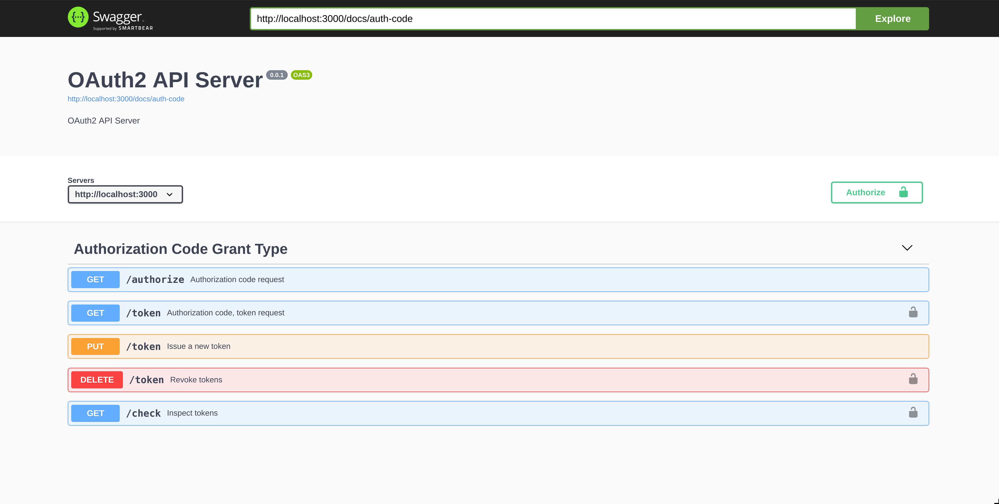

[](https://travis-ci.org/ngendah/bawabu)
[](https://codeclimate.com/github/ngendah/bawabu/maintainability)
[](https://codeclimate.com/github/ngendah/bawabu/test_coverage)
[](https://hakiri.io/github/ngendah/bawabu/master)

Bawabu 
=======================
A modular and extensible OAuth2 server.

It implements the following grants:
* authorization code with PKCE
* user credentials
* implicit

### Getting Started
Bawabu uses [OpenApi](https://www.openapis.org/) standard for its documentation. This makes it easy to get started.
The only required dependency is [docker-compose](https://docs.docker.com/compose/).
In order to get started;

1. Clone the project, [bawabu-docker](https://github.com/ngendah/bawabu-docker)

2. Build and run the app,
   ```
    $ docker-compose -f development.yml up
   ```
3. On your browser navigate to `localhost:8080`.


4. Reference documents are available at `docs/auth-code`, `docs/user-cred` and `docs/implicit`.

Seed values for the development server are available [here](./db/seeds.rb)


The server is still in active development and is some few steps away from being completely ready for production.
However, a minimal production deployment is available in the directory `docker-compose`.

## OAuth 2.0 Reference
[Framework](https://tools.ietf.org/html/rfc6749)

[Token revocation](https://tools.ietf.org/html/rfc7009)

[Token introspection](https://tools.ietf.org/html/rfc7662)

[Proof key for code exchange (PKCE)](https://tools.ietf.org/html/rfc7636)

[Security considerations](https://tools.ietf.org/html/rfc6819)
